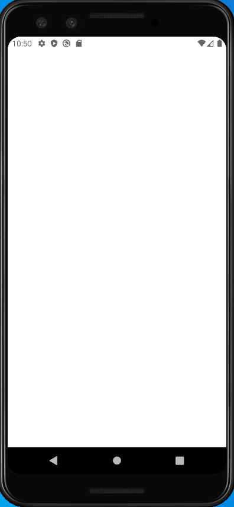

# WeatherApp

This application is a simple weather application where you can see the current weather conditions according to your location and the weather forecast for a week.

## Technologies

---
- Location Service
- Mvvm archtitecture
- Dagger Hilt for dependency injection
- Coroutines for asynchronous operations
- Retrofit and OkHttp for network operations
- Lottie Animation
- RecyclerView
- Fragments

---
